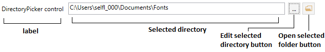

DirectoryPicker
===============

This control allows users to choose a directory.



## Properties

Property name|Description
-|-
LabelWidth|The label width
LabelText|The label content
SelectedDirectory|The selected directory

## Events

Event name|Description
-|-


## Methods

Method name|Description
-|-


## How to use

```
<orc:DirectoryPicker LabelText="DirectoryPicker control" LabelWidth="150" />
```
